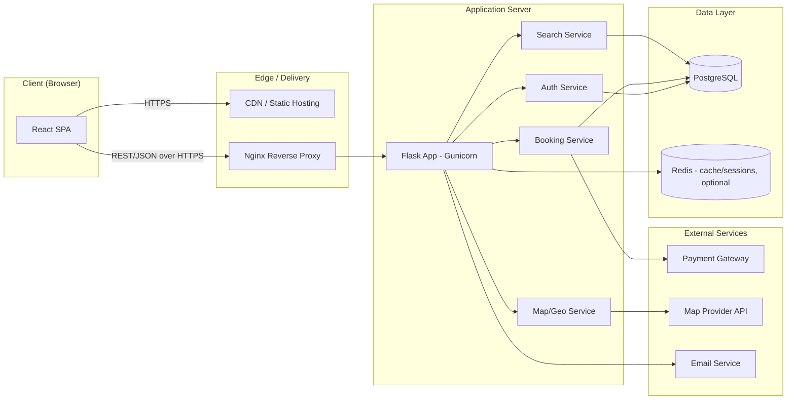
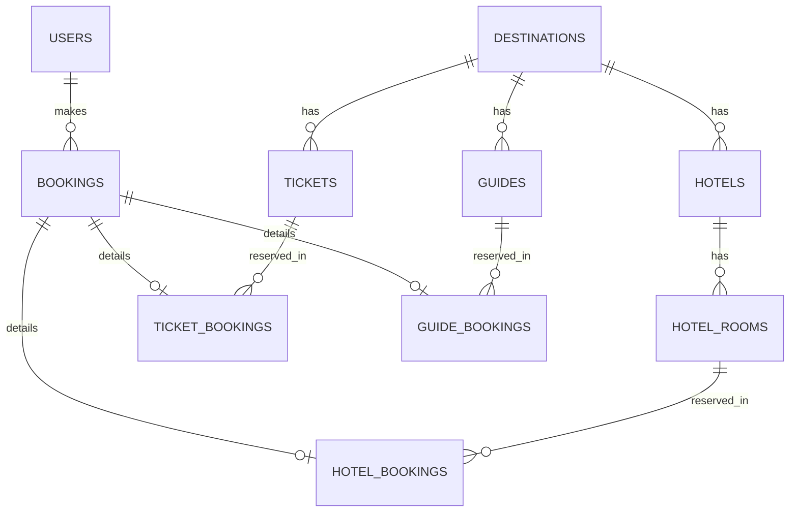
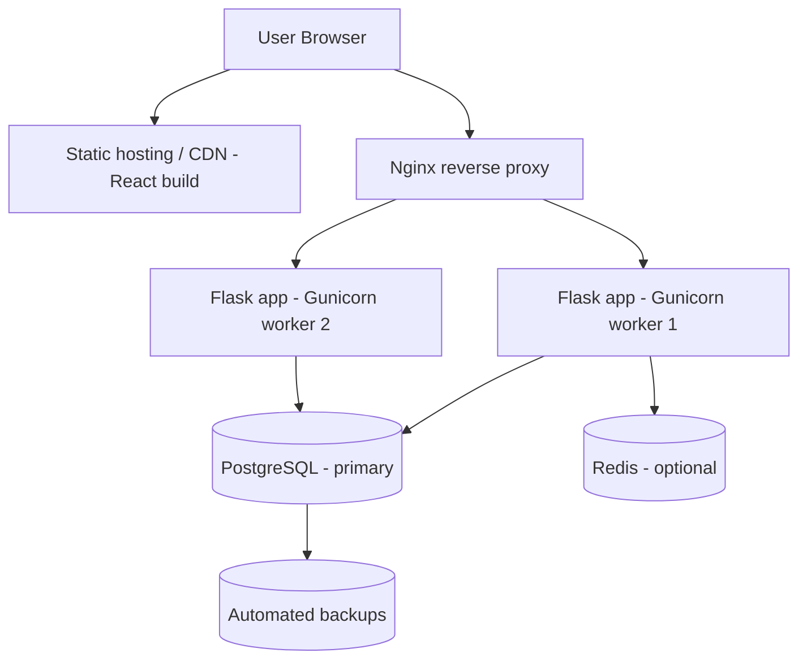

# Technical Architecture Document
## Travel Booking Website

| | |
|---|---|
| **Stack** | React (frontend) · Flask (backend, Python) · PostgreSQL (database) |
| **Style** | Client-Server, REST API, Single Page Application (SPA) |

---

## 1. Architecture Overview



The system follows a classic **three-tier architecture**:

1. **Presentation tier** — React SPA served as static assets, communicating with the backend purely via a REST API.
2. **Application tier** — Flask backend exposing REST endpoints, containing business logic for auth, search, and bookings.
3. **Data tier** — PostgreSQL as the system of record; Redis (optional) for caching/session storage.

## 2. Frontend Architecture (React)

### 2.1 Key Decisions
- **Routing**: `react-router-dom` for client-side routing (Home, Login, Signup, Search, Hotel Detail, Ticket Detail, Guide Detail, Map, About, Contact, My Bookings).
- **State management**: Local component state + React Context for auth/user state; a data-fetching library (`@tanstack/react-query` or similar) for server state, caching, and loading/error handling.
- **Styling**: CSS Modules or Tailwind CSS (recommend Tailwind for speed and consistency).
- **HTTP client**: `axios`, with a shared instance that attaches the auth token and centralizes error handling.
- **Forms**: `react-hook-form` (or controlled components) with client-side validation for login/signup/booking/contact forms.

### 2.2 Suggested Folder Structure
```
frontend/
├── public/
├── src/
│   ├── assets/
│   ├── components/         # Reusable UI (Navbar, Footer, Card, Button, Modal, MapView...)
│   ├── pages/               # Home, Login, Signup, Search, HotelDetail, TicketDetail,
│   │                         # GuideDetail, Map, About, Contact, MyBookings
│   ├── features/            # Feature-scoped logic (auth/, hotels/, tickets/, guides/, bookings/)
│   ├── context/              # AuthContext, etc.
│   ├── hooks/                 # useAuth, useFetch, useDebounce...
│   ├── services/               # api.js (axios instance), auth.service.js, hotel.service.js...
│   ├── routes/                  # AppRoutes.jsx, ProtectedRoute.jsx
│   ├── styles/
│   ├── utils/
│   └── App.jsx
└── package.json
```

### 2.3 Component Layering
- **Page components** compose feature components and call services/hooks.
- **Feature components** (e.g., `HotelCard`, `BookingForm`) encapsulate one concern and stay presentation-focused.
- **ProtectedRoute** wrapper redirects unauthenticated users to `/login` when they try to reach booking or "My Bookings" pages.

## 3. Backend Architecture (Flask)

### 3.1 Key Decisions
- **App structure**: Flask "application factory" pattern with **Blueprints** per domain (auth, hotels, tickets, guides, bookings, search, contact).
- **ORM**: SQLAlchemy (via Flask-SQLAlchemy) for models and queries; **Alembic** for migrations.
- **Serialization/validation**: Marshmallow or Pydantic for request/response schemas.
- **Auth**: Flask-JWT-Extended issuing access + refresh JWTs (details in Security Architecture doc).
- **CORS**: Flask-CORS, restricted to the frontend's origin(s).
- **WSGI server**: Gunicorn in production, behind Nginx.

### 3.2 Suggested Folder Structure
```
backend/
├── app/
│   ├── __init__.py           # App factory, extension init
│   ├── config.py              # Config classes (Dev/Test/Prod)
│   ├── extensions.py           # db, jwt, cors, migrate instances
│   ├── models/                  # user.py, hotel.py, ticket.py, guide.py, booking.py, destination.py
│   ├── schemas/                  # Marshmallow/Pydantic schemas
│   ├── blueprints/
│   │   ├── auth/                  # routes.py, services.py
│   │   ├── hotels/
│   │   ├── tickets/
│   │   ├── guides/
│   │   ├── bookings/
│   │   ├── search/
│   │   └── contact/
│   ├── utils/                       # error handlers, decorators, validators
│   └── services/                     # cross-cutting business logic
├── migrations/                        # Alembic migration scripts
├── tests/
├── wsgi.py
└── requirements.txt
```

### 3.3 Layering within the backend
`Route (Blueprint) → Schema validation → Service/business logic → Model/DB query → Response schema → JSON response`

This keeps route handlers thin and business logic testable independent of HTTP.

## 4. Database Architecture (PostgreSQL)

### 4.1 Core Entities (high-level)

| Table | Purpose | Key Fields (illustrative) |
|---|---|---|
| `users` | Registered users | id, name, email (unique), password_hash, created_at |
| `destinations` | Places that can be searched/browsed | id, name, country, description, lat, lng |
| `hotels` | Hotel listings | id, destination_id (FK), name, description, price_per_night, amenities, lat, lng |
| `hotel_rooms` | Room types/availability per hotel | id, hotel_id (FK), room_type, price, capacity, available_count |
| `tickets` | Transport/attraction tickets | id, destination_id (FK), title, type, price, date/schedule |
| `guides` | Travel guide profiles | id, destination_id (FK), name, bio, languages, rating, price_per_day |
| `bookings` | Unified booking record | id, user_id (FK), booking_type (hotel/ticket/guide), reference_id, status, total_price, created_at |
| `hotel_bookings` | Hotel-specific booking details | id, booking_id (FK), hotel_room_id (FK), check_in, check_out, guests |
| `ticket_bookings` | Ticket-specific booking details | id, booking_id (FK), ticket_id (FK), quantity, travel_date |
| `guide_bookings` | Guide-specific booking details | id, booking_id (FK), guide_id (FK), date, time_slot |
| `contact_messages` | Contact form submissions | id, name, email, message, created_at |

### 4.2 Entity Relationship (simplified)



A unified `bookings` table (with type-specific detail tables) keeps "My Bookings" simple to query while allowing each booking type to carry its own fields.

## 5. API Design (representative endpoints)

| Method | Endpoint | Purpose | Auth |
|---|---|---|---|
| POST | `/api/auth/register` | Create account | No |
| POST | `/api/auth/login` | Login, returns JWT | No |
| POST | `/api/auth/refresh` | Refresh access token | Refresh token |
| POST | `/api/auth/logout` | Invalidate session/token | Yes |
| GET | `/api/destinations?query=&page=` | Search destinations | No |
| GET | `/api/hotels/:id` | Hotel detail | No |
| GET | `/api/hotels?destination_id=&checkin=&checkout=` | List hotels | No |
| POST | `/api/bookings/hotel` | Create hotel booking | Yes |
| GET | `/api/tickets?destination_id=` | List tickets | No |
| POST | `/api/bookings/ticket` | Create ticket booking | Yes |
| GET | `/api/guides?destination_id=` | List guides | No |
| POST | `/api/bookings/guide` | Create guide booking | Yes |
| GET | `/api/bookings/me` | Current user's bookings | Yes |
| GET | `/api/map/points?bounds=` | Map markers within view | No |
| POST | `/api/contact` | Submit contact form | No |

All endpoints return JSON; errors follow a consistent shape (`{ "error": { "code", "message" } }`).

## 6. Third-Party Integrations

| Integration | Purpose | Notes |
|---|---|---|
| Map provider (Google Maps / Mapbox / Leaflet+OSM) | Map view, geocoding | Choice pending — see PRD open items |
| Payment gateway (e.g., Stripe/Razorpay) | Checkout for bookings | Choice pending — see PRD open items |
| Email service (e.g., SMTP/SendGrid) | Booking confirmation, contact form receipts | Optional for v1 |

## 7. Deployment Architecture



- **Frontend**: built with `npm run build`, served as static files via CDN/static host (e.g., Netlify/Vercel/S3+CloudFront) or served by Nginx alongside the API.
- **Backend**: containerized with Docker; run via Gunicorn behind Nginx; horizontally scalable (multiple worker processes/containers).
- **Database**: managed PostgreSQL instance (e.g., RDS or equivalent) with automated backups and connection pooling (e.g., PgBouncer) as load grows.
- **Environments**: separate Dev / Staging / Production configs, driven by environment variables.
- **CI/CD**: pipeline (e.g., GitHub Actions) to run tests/lint on PRs and deploy on merge to main.

## 8. Caching & Performance (optional, as the app grows)

- Redis cache for frequently-read, rarely-changed data (destination lists, popular hotels).
- Database indexing on frequently filtered columns (`destination_id`, `email`, date ranges).
- Pagination on all list endpoints (search, hotels, tickets, guides).
- Image optimization/lazy loading on the frontend for hotel/destination photos.
