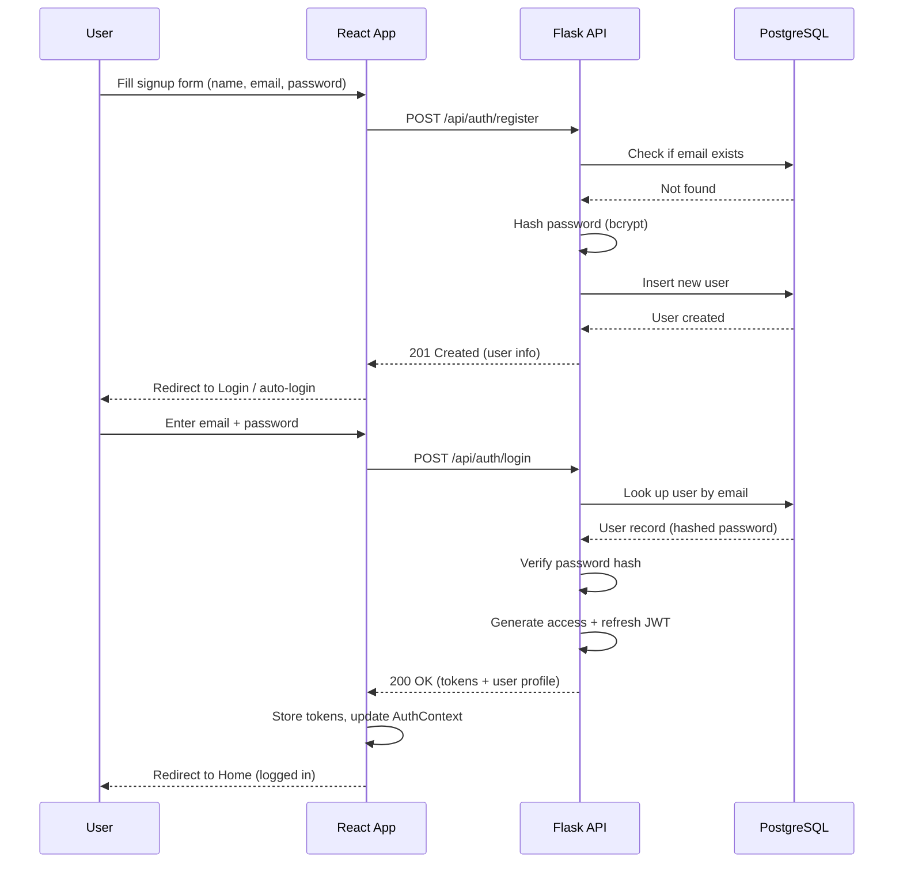
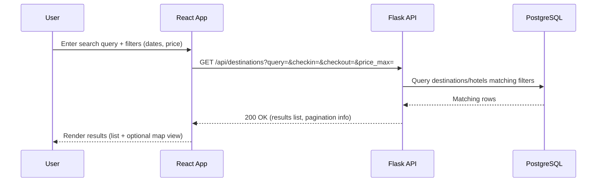
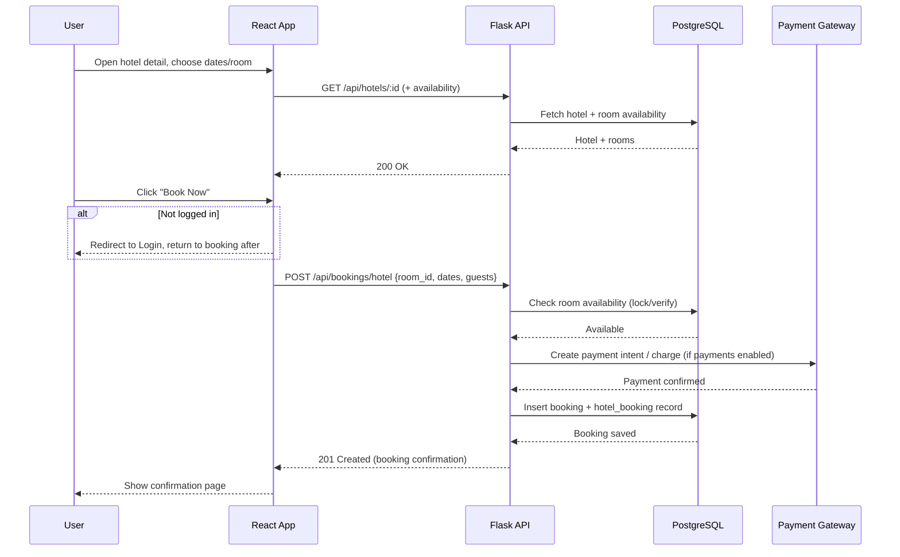
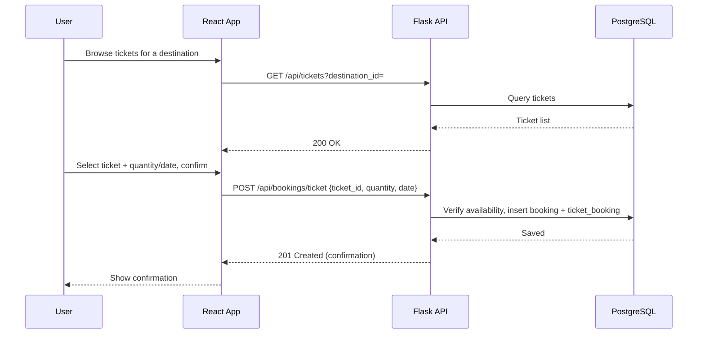
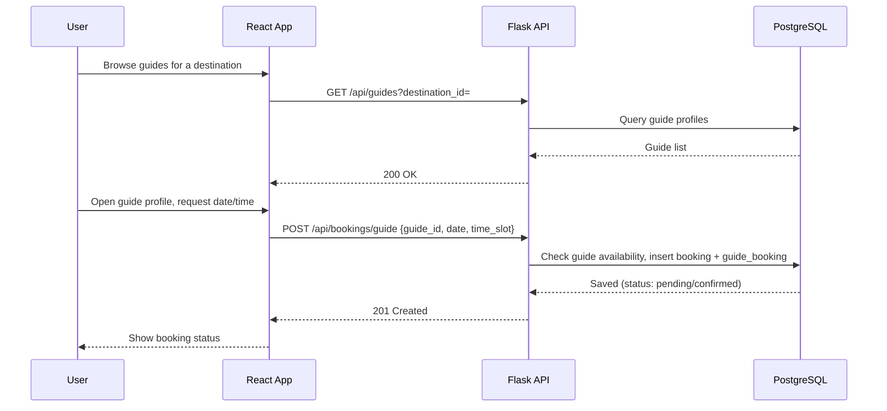
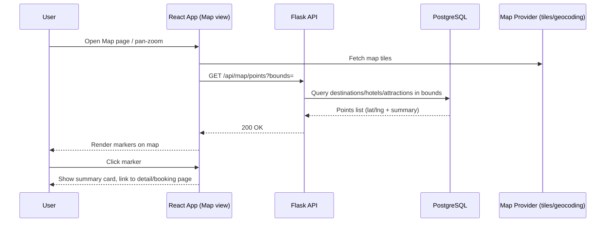
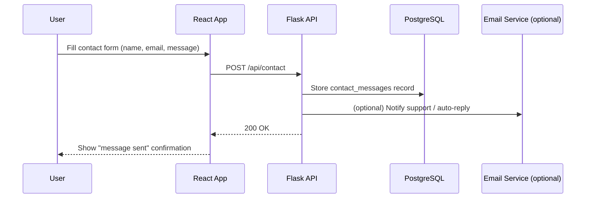
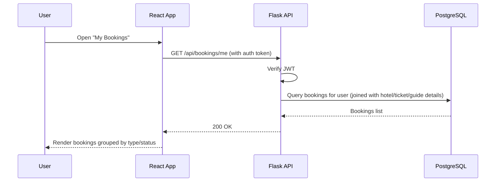
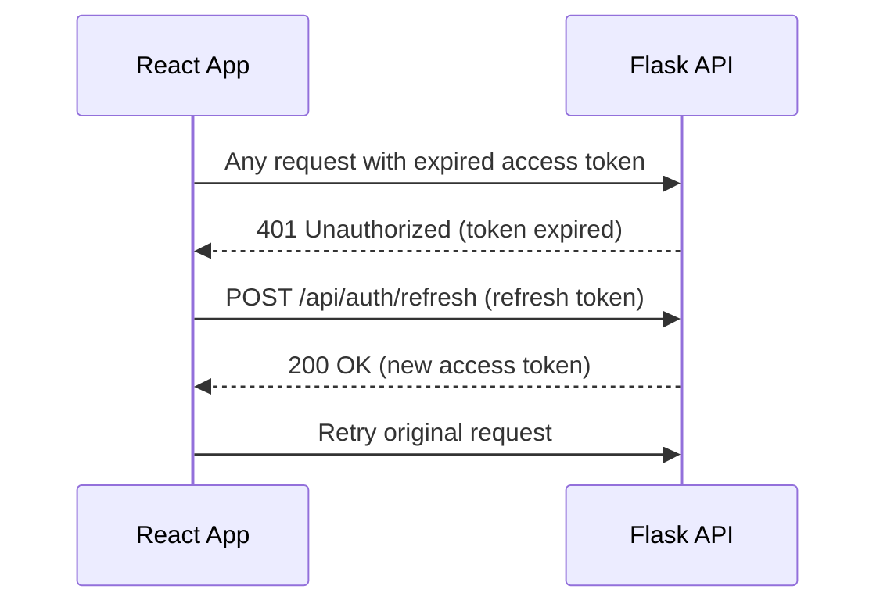

# System Workflow Document
## Travel Booking Website

This document describes the key end-to-end workflows through the system: React frontend → Flask REST API → PostgreSQL.

---

## 1. User Registration & Login

## 2. Destination / Hotel Search

## 3. Hotel Booking

## 4. Ticket Booking

## 5. Travel Guide Booking

## 6. Map Interaction

## 7. Contact Form Submission

## 8. My Bookings View

## 9. Cross-Cutting: Auth Token Refresh (background flow)

This transparent refresh flow keeps users logged in across a session without forcing repeated logins, while access tokens remain short-lived for security (see Security Architecture document).
